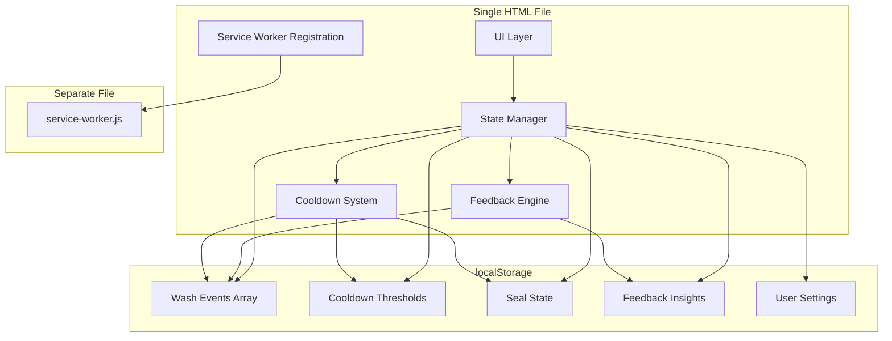
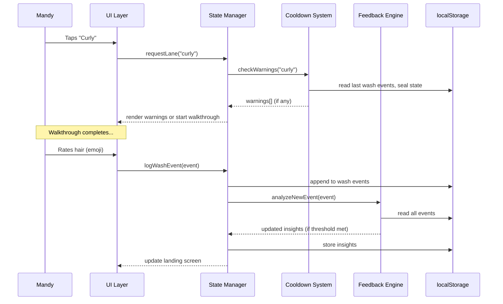

# Design Document: Adaptive Hair Routine

## Overview

A full rebuild of the existing `hair-routine.html` into an adaptive, science-backed hair care guidance app. The current app is a static reference manual with tabs — the rebuild transforms it into a guided, step-by-step tool with an adaptive feedback engine that learns from Mandy's ratings over time.

**Core transformation:** From "reference manual you read" → "calm companion that remembers and adapts."

**Architecture:** Single HTML file with embedded CSS/JS, localStorage for all persistence, service worker for offline PWA capability. No backend, no build tools, no dependencies. Runs on phone (bathroom, wet hands), iPad, and desktop. Deployed via GitHub Pages at `https://mandy-apperkeeper.github.io/hair-routine/`.

**Key design decisions:**
- Single-file architecture (like the knitting app) — simple deployment, easy to iterate
- localStorage for all data — no account, no sync complexity, JSON export/import for backup
- Weighted moving average for the feedback engine — transparent, explainable, no ML black box
- Step-by-step walkthrough as primary interaction — one thing at a time, not a wall of text
- Dark color scheme with high contrast — bathroom glare reduction, WCAG AA compliance

---

## Apper Keeper Design Alignment

This app is an Apper Keeper product. Every design decision must satisfy the six principles. Here's how each manifests in this specific app:

### 1. Calm Over Captive

The hair routine is a physical-primary activity. Mandy is in the shower, hands wet, applying products. The app is a glance-and-go reference, not a destination.

**What this means here:**
- No notifications, no streaks, no "you haven't washed in 5 days!" guilt
- The "too soon" warnings are protective (preventing damage), never nagging
- Insights appear passively on the landing screen — never pushed
- Success = Mandy opens the app, gets what she needs in 5 seconds, puts the phone down
- The feedback rating is optional and takes one tap (emoji). Never a form, never required.
- No engagement metrics. The app doesn't track "sessions" or "daily active use"

**The test:** If Mandy stops using the app for two weeks and comes back, it should feel welcoming, not accusatory. "Last wash: 14 days ago" is neutral information, not a judgment.

### 2. Convivial Over Controlling

The app offers structure but never enforces it. Mandy can skip steps, ignore warnings, override cooldowns, and use products in whatever order she wants.

**What this means here:**
- Every warning is dismissable. "Too soon to clarify" → "Got it, doing it anyway" → done
- The walkthrough is a guide, not a mandate. She can exit at any step
- The feedback engine proposes threshold changes — she confirms or rejects
- No enforced order: she can go straight to a specific step if she knows what she's doing
- The app adapts to her, not the other way around. If she consistently overrides a warning and rates well, the app learns to stop warning

**The test:** A first-time user and a 6-month user see the same app — the experienced user just moves faster through it.

### 3. Book-Feel Over App-Feel

The interface should feel like a beautiful, well-organized reference card — not like a typical health/wellness app with gamification and progress rings.

**What this means here:**
- Typography-driven hierarchy. Large, readable type. Generous whitespace.
- No progress bars, achievement badges, or "level up" mechanics
- Information density is low — one step at a time, breathing room between elements
- The Learn section reads like a well-written article, not a FAQ database
- Colour is used for meaning (warnings, science badges), not decoration
- The dark theme is quiet and warm, not neon or clinical

**Visual direction:** Dark background, warm accent colours (gold, green, soft rose). Typography does the heavy lifting. Feels like a personal notebook, not a medical app.

### 4. Progressive Mastery Over Feature Dumps

A beginner and an expert see the same app. The beginner follows every step. The expert taps "Curly" and skips to the step they need.

**What this means here:**
- Landing screen is immediately usable: three buttons, tap one, follow along
- Science badges on steps are visible but don't demand attention — they're there when you're curious
- The Learn section exists for depth but never intrudes on the daily flow
- Insights appear only after enough data accumulates — the app starts simple and grows richer
- No onboarding, no tutorial, no "welcome wizard." Open → tap → go.

**The test:** Mandy's first use takes 2 seconds to understand. After 3 months, she's getting personalized insights she didn't have to configure.

### 5. Offline-First as Philosophy

This app is used in the bathroom. WiFi may be weak. The phone may be in airplane mode. It must work perfectly without any network connection.

**What this means here:**
- Service worker caches everything on first load — fully functional offline forever after
- All data lives in localStorage on the device — no server dependency
- No loading spinners, no "connecting..." states for core features
- Export/import is the sync mechanism (manual, intentional, user-controlled)
- The app never breaks because of network state

**The test:** Turn off WiFi and cellular. The app works identically.

### 6. Accessibility as Foundation

Wet hands, steamy bathroom, glancing between mirror and phone. This is a challenging physical context — accessibility isn't just about screen readers, it's about usability under real conditions.

**What this means here:**
- Touch targets minimum 48×48dp with 8dp spacing (wet fingers are imprecise)
- High contrast text (WCAG AA minimum, AAA where feasible)
- Large body text (16px minimum on mobile, likely 18px)
- Keyboard navigable throughout (for desktop use)
- Screen reader compatible with semantic HTML and ARIA labels
- No reliance on colour alone for information (always paired with text/icon)
- Timer has both audible and visual completion signals
- No motion/animation that could trigger vestibular responses — state changes are instant or use simple opacity transitions

**The test:** Can Mandy use this with wet hands, in a steamy bathroom, glancing at it from arm's length? If any interaction requires precision or sustained attention, redesign it.

### Physical Context Constraints (Hair Care Specific)

Like the knitting app's "hands occupied with yarn" constraint, the hair app has:
- **Hands are wet/soapy/oily.** Touch must be imprecise-friendly.
- **Eyes alternate.** Glance at phone → back to mirror → back to phone. Information must be scannable in 1-2 seconds.
- **Sessions are 15-45 minutes.** The app maintains state across the entire routine.
- **Lighting varies.** Bright bathroom lights, steamy mirror, water droplets on screen.
- **The tool is secondary.** The hair care is the activity. The app serves it.

### AI Positioning

The feedback engine is AI-adjacent (pattern recognition, adaptive recommendations) but follows the Apper Keeper rule: **AI is invisible infrastructure.**

- The app never says "AI recommends..." or "Our algorithm suggests..."
- Insights are presented as observations from data: "Based on your last 12 washes, you feel best at 4-day intervals"
- The user always understands *why* — every insight cites the data behind it
- No black box. The algorithm is simple enough to explain in one sentence.

### Central Object

In the Apper Keeper framework, each app has a **central object** the experience orbits. For the hair app, it's the **Wash Event** — a single instance of caring for your hair, with all its context (what you did, conditions, how it turned out). The app is a journal of wash events that gets smarter over time.

## Architecture

### High-Level Component Diagram



### Data Flow



### File Structure

```
hair-routine-v2.html    — Main app (HTML + CSS + JS, single file)
hair-sw.js              — Service worker (must be separate file for SW registration)
```

**Rationale for single-file:** Matches the existing pattern, zero build tooling, easy to serve from any static host or open locally. The service worker must be a separate file (browser requirement for SW scope), but everything else stays in one file.

## Components and Interfaces

### UI Components

#### 1. Landing Screen
- **Status Bar:** Days since last wash, days since last clarify, seal state indicator
- **Three Action Buttons:** Curly, Blowout, Refresh (large, touch-friendly, 64px height minimum)
- **Insight Card:** Personalized recommendation from Feedback Engine (appears after 10+ events)
- **Quick Links:** History, Learn, Settings (secondary, smaller)

#### 2. Walkthrough Engine
- **Step Display:** Single step visible at a time with step counter (e.g., "Step 3 of 9")
- **Timer Component:** Inline countdown with start/pause/reset, audible + visual alert on completion
- **Navigation:** Back button, Next button (large, bottom of screen for thumb reach)
- **Warning Overlay:** Non-blocking banner at top when cooldown warning applies
- **Humidity Prompt:** Three-button selector shown at walkthrough start
- **Completion Screen:** Rating prompt (5 emoji scale) + event summary

#### 3. History View
- **Event List:** Reverse chronological, showing date, lane, rating, interval
- **Summary Stats:** Average interval, most common lane, rating trend
- **Export/Import:** JSON download button, file picker for import

#### 4. Learn Section
- **Expandable Cards:** Science topics, product inventory, frizz diagnostic
- **Frizz Diagnostic:** Interactive — tap a symptom, see the cause and fix
- **Product Inventory:** Grouped by tier (primary, supporting, use-up)

#### 5. Settings
- **Threshold Display:** Current cooldown values with manual override
- **Pending Proposals:** Feedback Engine suggestions awaiting confirmation
- **Data Management:** Export, import, reset to defaults

### Core Modules (JavaScript)

```
StateManager
├── getState() → full app state from localStorage
├── saveWashEvent(event) → append + trigger feedback analysis
├── getSealState() → boolean
├── setSealState(active) → update seal tracking
├── getThresholds() → current cooldown values
└── setThreshold(key, value) → update specific threshold

CooldownSystem
├── checkWarnings(lane, humidity) → Warning[]
├── getTimeSince(eventType) → hours since last occurrence
├── isOverride(warning) → boolean (user dismissed)
└── recordOverride(warningType) → log for feedback engine

FeedbackEngine
├── analyze() → recalculate all insights from event history
├── getInsights() → current insight cards for landing
├── getIntervalRatings() → avg rating per wash interval
├── getProductCorrelations() → product → avg rating mapping
├── getHumidityCorrelations() → humidity level → avg rating
├── proposeThresholdChange(type, direction) → Proposal
└── checkOverridePatterns() → proposals from successful overrides

WalkthroughEngine
├── start(lane, humidity) → Step[]
├── getCurrentStep() → Step
├── next() → Step | CompletionScreen
├── back() → Step
├── getProgress() → { current, total }
└── getStepsForLane(lane, humidity) → Step[] (with product substitutions)

TimerManager
├── start(durationSeconds, onComplete) → timerId
├── pause(timerId)
├── resume(timerId)
├── reset(timerId, durationSeconds)
└── getRemaining(timerId) → seconds
```

### Interfaces

```typescript
// Core data types (documented as TypeScript interfaces for clarity,
// implemented as plain JS objects)

interface WashEvent {
  id: string;              // UUID
  date: string;            // ISO 8601
  lane: "curly" | "blowout" | "refresh";
  treatments: string[];    // e.g. ["clarify", "protein", "deep-condition", "bond-repair"]
  products: string[];      // product IDs used
  humidity: "dry" | "moderate" | "humid";
  dewPoint: number | null; // detected dew point in °F
  rating: 1 | 2 | 3 | 4 | 5 | null;
  intervalDays: number;    // days since previous wash
  overrides: string[];     // warning types that were dismissed
  notes: string;           // optional free text
}

interface CooldownThresholds {
  washMinDays: number;         // default: 2, floor: 1
  clarifyMinDays: number;      // default: 5, floor: 3
  proteinMinDays: number;      // default: 7, floor: 5
  treatmentWhileSealed: boolean; // always warn (no threshold)
}

interface SealState {
  active: boolean;
  appliedDate: string | null;  // ISO 8601
  washesSinceApplied: number;  // resets seal after 4
}

interface FeedbackInsight {
  type: "interval" | "product" | "humidity" | "override";
  message: string;
  confidence: number;          // 0-1, based on sample size
  dataPoints: number;          // how many events support this
  createdDate: string;
}

interface ThresholdProposal {
  type: "wash" | "clarify" | "protein";
  direction: "increase" | "decrease";
  currentValue: number;
  proposedValue: number;
  reason: string;
  supportingEvents: number;
  averageRating: number;
  status: "pending" | "accepted" | "rejected";
}

interface Warning {
  type: "too-soon-wash" | "too-soon-clarify" | "too-soon-protein" | "seal-blocks-treatment" | "lane-conflict-pq69" | "lane-conflict-seal";
  message: string;
  detail: string;
  dismissable: boolean;        // always true
}

interface Step {
  number: number;
  title: string;
  instruction: string;
  productId: string | null;
  scienceBadge: string | null;
  timer: { duration: number; label: string } | null;
  tip: string | null;
}
```

## Data Models

### localStorage Schema

All data stored under a single key `hair-routine-data` as a JSON object:

```json
{
  "version": 2,
  "events": [WashEvent, ...],
  "thresholds": CooldownThresholds,
  "sealState": SealState,
  "insights": [FeedbackInsight, ...],
  "proposals": [ThresholdProposal, ...],
  "settings": {
    "defaultHumidity": null,
    "soundEnabled": true,
    "vibrationEnabled": true
  },
  "lastExport": "2026-05-10T..."
}
```

**Storage budget:** localStorage typically allows 5-10MB. Each WashEvent is ~300 bytes. At one wash every 3 days, that's ~120 events/year = ~36KB/year. Storage is not a concern for years of use.

**Migration strategy:** The `version` field allows future schema changes. On load, if version < current, run migration functions sequentially.

### Event Recording Flow

When a walkthrough completes:
1. Generate UUID for event
2. Calculate `intervalDays` from previous event's date
3. Record all products used (from walkthrough steps)
4. Record humidity selection
5. Record any overridden warnings
6. Prompt for rating (can be skipped → null)
7. Append to events array
8. Update seal state (if blowout with Marc Anthony → active; if clarify → reset)
9. Increment `washesSinceApplied` if seal was active
10. Trigger Feedback Engine analysis

### Seal State Logic

```
IF event.lane === "blowout" AND "marc-anthony-blowout" in event.products:
    sealState.active = true
    sealState.appliedDate = event.date
    sealState.washesSinceApplied = 0

ELSE IF "everpure-clarifying" in event.products OR "kinky-curly" in event.products:
    sealState.active = false
    sealState.appliedDate = null
    sealState.washesSinceApplied = 0

ELSE IF sealState.active:
    sealState.washesSinceApplied += 1
    IF sealState.washesSinceApplied >= 4:
        sealState.active = false  // seal degraded
```

## Feedback Engine Algorithm

### Design Philosophy

The feedback engine uses **weighted moving averages** — not machine learning. This keeps it:
- Transparent (Mandy can understand why it's recommending something)
- Explainable (every insight cites the data behind it)
- Predictable (no surprising behavior changes)
- Lightweight (runs in milliseconds, no libraries)

### Insight Generation

#### 1. Optimal Wash Interval

After 10+ rated events:

```
For each interval bucket (1-day, 2-day, 3-day, ..., 7-day+):
    events_at_interval = filter events where intervalDays rounds to bucket
    if events_at_interval.length >= 3:
        avg_rating = mean(events_at_interval.map(e => e.rating))
        store as interval_ratings[bucket]

best_interval = bucket with highest avg_rating (minimum 3 data points)
insight = "Based on your last N washes, you feel best washing every X days"
```

#### 2. Product Correlations

After 10+ rated events:

```
For each product used across all events:
    events_with_product = filter events containing product
    events_without_product = filter events NOT containing product
    if both sets have 3+ events:
        avg_with = mean(events_with_product ratings)
        avg_without = mean(events_without_product ratings)
        if abs(avg_with - avg_without) > 0.5:
            insight = product correlates positively/negatively
```

#### 3. Humidity Correlations

After 10+ rated events:

```
For each humidity level (dry, moderate, humid):
    events_at_level = filter events with that humidity
    if events_at_level.length >= 3:
        avg_rating = mean(ratings)
        if avg_rating < 3.0:
            insight = "Your hair tends to struggle on [level] days"
```

#### 4. Threshold Adjustment Proposals

```
For each threshold type (wash, clarify, protein):
    overridden_events = filter events where this threshold was overridden
    if overridden_events.length >= 5:
        avg_override_rating = mean(overridden_events ratings)
        if avg_override_rating >= 4.0:
            propose DECREASE threshold by 1 day (if above hard floor)
        
    events_at_threshold = filter events at exactly the threshold interval
    if events_at_threshold.length >= 5:
        avg_rating = mean(ratings)
        if avg_rating < 2.5:
            propose INCREASE threshold by 1 day
```

### Hard Floors (Never Adjustable)

| Threshold | Default | Hard Floor | Science Basis |
|-----------|---------|------------|---------------|
| Wash minimum | 2 days | 1 day | Sulfate cuticle stripping recovery |
| Clarify minimum | 5 days | 3 days | Protective silicone layer rebuild time |
| Protein minimum | 7 days | 5 days | Protein deposition plateau (Croda 2025) |

### Confidence Scoring

Insights include a confidence score based on sample size:

```
confidence = min(1.0, dataPoints / 15)
```

- 3-5 events: low confidence (0.2-0.33) — shown with "early pattern" qualifier
- 6-10 events: medium confidence (0.4-0.67) — shown normally
- 11-15+ events: high confidence (0.73-1.0) — shown with emphasis

Only insights with confidence ≥ 0.2 (3+ data points) are surfaced.

## Error Handling

### localStorage Failures

- **Storage full:** Detect `QuotaExceededError` on write. Show message: "Storage is full — export your data and clear old events." Offer one-tap export before clearing.
- **localStorage unavailable:** Detect on app load (try/catch a test write). Show persistent banner: "Private browsing mode detected — your data won't be saved between sessions." App still functions for walkthrough guidance, just doesn't persist.
- **Corrupted data:** Wrap all `JSON.parse` in try/catch. If parse fails, offer to reset (with export of raw string for manual recovery).

### Timer Edge Cases

- **Tab backgrounded:** Use `requestAnimationFrame` + timestamp comparison rather than `setInterval` alone. When tab regains focus, calculate elapsed time from start timestamp.
- **Phone locked:** Same approach — on visibility change, recalculate remaining time.
- **Multiple timers:** Only one timer active at a time per walkthrough step. Starting a new timer stops the previous one.

### Data Integrity

- **Duplicate events:** Check for events with same date + lane within 1 hour. Warn before creating duplicate.
- **Future dates:** Reject events with dates in the future.
- **Import validation:** Validate imported JSON against schema before merging. Reject malformed data with specific error message.

### Service Worker

- **Registration failure:** App works fully without SW — just loses offline caching. Log warning to console, don't bother user.
- **Cache invalidation:** SW uses cache-first strategy with version number in cache name. New version = new cache = old cache deleted on activation.

## Correctness Properties

*A property is a characteristic or behavior that should hold true across all valid executions of a system — essentially, a formal statement about what the system should do. Properties serve as the bridge between human-readable specifications and machine-verifiable correctness guarantees.*

### Property 1: Days-since calculation

*For any* two dates (a past event date and a current date), the days-since calculation shall return the correct non-negative integer number of days between them, and shall return "today" when the dates are the same calendar day regardless of time.

**Validates: Requirements 1.4**

### Property 2: Seal state machine transitions

*For any* sequence of wash events (curly, blowout with Marc Anthony, blowout without Marc Anthony, clarify), the seal state shall be: active after a blowout with Marc Anthony, inactive after a clarify, inactive after 4 non-clarifying washes following activation, and unchanged by other event types.

**Validates: Requirements 3.3, 3.4, 3.5**

### Property 3: Time-based cooldown warnings

*For any* event history and current cooldown thresholds, the cooldown system shall produce a warning if and only if the time since the last relevant event (wash, clarify, or protein) is less than the corresponding threshold value.

**Validates: Requirements 4.2, 5.1, 5.2, 5.3**

### Property 4: State-based warnings

*For any* app state, the cooldown system shall produce a lane-conflict warning when: (a) selecting Blowout and the most recent wash used PQ-69 gel, (b) selecting Curly and the seal state is active, or (c) initiating a treatment and the seal state is active. No state-based warning shall fire when these conditions are not met.

**Validates: Requirements 3.1, 3.2, 5.4**

### Property 5: Override recording

*For any* warning that is dismissed during a walkthrough, the resulting wash event's overrides array shall contain the dismissed warning type, and the overrides array shall contain only warning types that were actually dismissed.

**Validates: Requirements 5.6**

### Property 6: Event storage round-trip

*For any* valid wash event (with arbitrary lane, products, humidity, rating, and overrides), saving the event and reading it back shall produce an identical object with all fields preserved.

**Validates: Requirements 6.2, 8.4, 9.1**

### Property 7: Interval average calculation

*For any* set of 10 or more rated wash events, the feedback engine's calculated average rating per interval bucket shall equal the arithmetic mean of ratings for events in that bucket (within floating-point tolerance).

**Validates: Requirements 6.3**

### Property 8: Insight surfacing threshold

*For any* set of wash events where at least one interval bucket contains 5 or more rated events, the feedback engine shall generate an insight for that bucket. For buckets with fewer than 5 events, no insight shall be generated.

**Validates: Requirements 6.4**

### Property 9: Humidity correlation detection

*For any* set of 10+ rated events where a humidity level has 3 or more events with average rating below 3.0, the feedback engine shall generate a humidity-related insight identifying that level as problematic.

**Validates: Requirements 6.5, 8.5**

### Property 10: Product correlation detection

*For any* set of 10+ rated events where a product appears in 3+ events AND the absolute difference between average rating with that product versus without exceeds 0.5, the feedback engine shall generate a product correlation insight.

**Validates: Requirements 6.6**

### Property 11: Threshold adjustment proposals

*For any* set of events where (a) a specific threshold was overridden 5+ times with average rating ≥ 4.0, the engine shall propose decreasing that threshold; OR (b) events at a specific interval have 5+ occurrences with average rating < 2.5, the engine shall propose increasing that threshold.

**Validates: Requirements 6.7, 7.2, 7.3**

### Property 12: Hard floor enforcement

*For any* sequence of threshold adjustments (proposals accepted, manual changes, or feedback engine modifications), the wash threshold shall never be less than 1 day, the clarify threshold shall never be less than 3 days, and the protein threshold shall never be less than 5 days.

**Validates: Requirements 4.5, 7.6**

### Property 13: Humidity-based product substitution

*For any* curly lane walkthrough where humidity is set to "humid", the gel step shall reference Got2b Ultra Glued instead of NYM Curl Talk Gel. For humidity levels "dry" or "moderate", the gel step shall reference NYM Curl Talk Gel.

**Validates: Requirements 8.2**

### Property 14: Export/import round-trip

*For any* valid app state (events, thresholds, seal state, insights, settings), exporting to JSON and importing that JSON shall produce an app state identical to the original.

**Validates: Requirements 9.4, 9.5**

### Property 15: History chronological ordering

*For any* set of wash events with distinct dates, the history view shall present them in strictly reverse chronological order (newest first).

**Validates: Requirements 9.3**

### Property 16: Refresh walkthrough variant selection

*For any* event history where the most recent wash event used the curly lane, the refresh walkthrough shall present post-curly guidance. Where the most recent wash used the blowout lane, it shall present post-blowout guidance.

**Validates: Requirements 12.3**

## Testing Strategy

### Unit Testing Approach

Given the single-file architecture and no build tooling, testing uses a pragmatic approach:

- **Feedback Engine logic:** Testable as pure functions (input: event array → output: insights). Extract into a testable module pattern within the file.
- **Cooldown System logic:** Pure function (input: events + thresholds + seal state → output: warnings). Fully deterministic.
- **Seal State transitions:** State machine with clear inputs and outputs.
- **Timer calculations:** Pure math (start time + duration → remaining).

### Property-Based Testing

Property-based testing is appropriate for this feature because:
- The Feedback Engine processes arbitrary collections of wash events and must produce correct insights regardless of event ordering, rating distribution, or interval patterns
- The Cooldown System must correctly evaluate warnings for any combination of event history and threshold values
- The Seal State machine must maintain consistency through any sequence of wash/clarify/blowout events
- Data import/export must round-trip without loss

**Library:** [fast-check](https://github.com/dubzzz/fast-check) (JavaScript PBT library, zero dependencies, works in browser and Node)

**Configuration:** Minimum 100 iterations per property test.

**Tag format:** Each test tagged with `Feature: adaptive-hair-routine, Property {N}: {description}`

### Example-Based Unit Tests

These cover specific scenarios and UI behavior not suited to property testing:

- Landing screen renders three action buttons (1.1)
- Touch targets meet minimum size (1.2, 11.2, 13.4)
- Walkthrough navigation (forward, back, completion) (2.1, 2.5, 2.6)
- Timer start/pause/reset/completion alert (2.3, 2.4)
- Default threshold initialization (7.1)
- Warning dismissal UI (5.5)
- Rating prompt appearance (6.1)
- Curly/Blowout step ordering matches verified protocol (12.1, 12.2)
- Learn section content presence (10.1–10.5)
- Semantic HTML structure (13.7)
- Focus indicators (13.6)
- Keyboard navigation (13.3)

### Integration Testing

- Manual testing on target devices (phone in bathroom, iPad, desktop)
- Service worker caching verified by going offline after first load
- localStorage persistence verified across browser restarts
- Timer accuracy verified against wall clock over 5-minute durations
- Responsive layout at key breakpoints: 320px, 375px, 768px, 1024px, 1440px

### Edge Case Coverage (covered by property test generators)

- Empty event history (first-time user)
- All events with null ratings (user never rates)
- Events spanning daylight saving time transitions
- Very long intervals (30+ days between washes)
- Rapid successive events (testing within minutes)
- Import of data from a future schema version
- localStorage at 90%+ capacity
- Seal state with exactly 4 washes (boundary)
- Threshold at hard floor (cannot decrease further)
