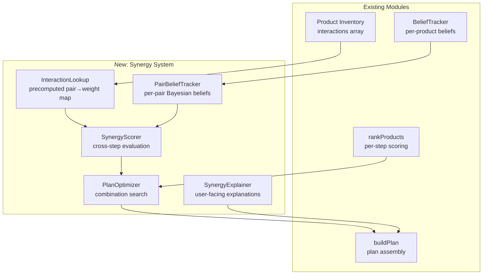

# Design Document — Product Synergy Pairing

## Overview

Product Synergy Pairing transforms plan generation from isolated per-step product selection into a system-aware optimization that actively prefers complementary product combinations. The current `buildPlan()` calls `rankProducts()` independently for each step, producing locally optimal but globally naive plans. This design adds a `SynergyScorer` module and modifies `buildPlan()` to evaluate cross-step interactions, detect synergy chains, and select the combination that maximizes overall plan quality.

The feature integrates with the existing `interactions` array on each product's intelligence data (which already encodes `enables`, `blocks`, `neutral`, `enhances`, `reduces`, and `outclassed_by` relationships) and the `BeliefTracker` (Normal-Normal conjugate model). It adds a new pair-level Bayesian belief system that learns which product combinations actually work well for the user over time.

**Key constraint:** All computation runs synchronously on the main thread in a single-file HTML app. The design bounds the search space to 729 combinations maximum (3 candidates × 6 steps) and targets <50ms total plan generation time.

## Architecture



### Data Flow

1. On app load (or inventory change), `InteractionLookup.build(inventory)` precomputes a map of `(productA, productB) → { type, weight, note }` from all products' `interactions` arrays.
2. When `buildPlan()` is called, it first calls `rankProducts()` for each step to get the top 3 candidates per step (existing behavior, unchanged).
3. `PlanOptimizer.optimize(candidatesPerStep, interactionLookup, pairBeliefs)` evaluates combinations and returns the best plan.
4. `SynergyExplainer.explain(selectedPlan, interactionLookup)` generates user-facing explanations for any synergy-driven selections.
5. When a wash day is rated, `PairBeliefTracker.update(productsUsed, rating)` updates Bayesian beliefs for all pairs present in that plan.

### Integration Points

- **buildPlan()** — Modified to call PlanOptimizer instead of simply taking rank-1 from each step.
- **renderPlanStep()** — Extended to show synergy explanations via the existing [ℹ] info popup.
- **renderAlternatives()** — Extended to show synergy impact indicators (+/−) next to each alternative.
- **logWashDay()** — Extended to call PairBeliefTracker.update() after BeliefTracker.updateBeliefs().

## Components and Interfaces

### InteractionLookup

Precomputed bidirectional map for O(1) pair lookups during plan optimization.

```javascript
const InteractionLookup = {
    // Internal: Map<string, { type, weight, note, confidence }>
    // Key format: "productA|productB" (alphabetically sorted for bidirectional)
    _map: {},

    /**
     * Build lookup from inventory's interaction arrays.
     * Called once on load and when inventory changes.
     * @param {Array} inventory - Full product inventory
     */
    build: function(inventory) { ... },

    /**
     * Get interaction between two products.
     * @returns {{ type: string, weight: number, note: string } | null}
     */
    get: function(productIdA, productIdB) { ... },

    /**
     * Get all interactions for a given product.
     * @returns {Array<{ partnerId, type, weight, note }>}
     */
    getAll: function(productId) { ... }
};
```

**Weight calculation from confidence:**
- `enables` + high confidence → +1.0
- `enables` + medium confidence → +0.6
- `enables` + low confidence → +0.3
- `blocks` + high confidence → −1.0
- `blocks` + medium confidence → −0.6
- `blocks` + low confidence → −0.3
- `enhances` → +0.5 (always medium — general benefit)
- `reduces` → −0.3 (always low — slight negative)
- `neutral` / no data → 0

**Wildcard handling:** Interactions with `with: '*'` (e.g., Wonder Water's "enhances all downstream") are expanded to all products in later steps during plan optimization, not stored as individual pairs.

### SynergyScorer

Evaluates the synergy quality of a complete product combination across steps.

```javascript
const SynergyScorer = {
    /**
     * Score a candidate plan's cross-step synergy.
     * @param {Array<{ stepIndex, productId }>} plan - One product per step
     * @param {object} interactionLookup - Precomputed lookup
     * @param {object} pairBeliefs - Learned pair beliefs
     * @returns {{ score: number, chains: Array, explanations: Array }}
     */
    score: function(plan, interactionLookup, pairBeliefs) { ... },

    /**
     * Detect synergy chains (3+ consecutive enables).
     * @returns {Array<{ products: Array<string>, bonus: number }>}
     */
    detectChains: function(plan, interactionLookup) { ... }
};
```

**Scoring formula:**

```
synergyScore = Σ(pairwise interactions) + chainBonuses

For each pair (i, j) where i < j:
  baseWeight = interactionLookup.get(i, j).weight  // from domain knowledge
  proximityFactor = 1.0 / (stepDistance(i, j))      // adjacent=1.0, 2-apart=0.5, etc.
  learnedAdjustment = pairBeliefs.getAdjustment(i, j)  // 0 until 5+ observations
  
  pairContribution = (baseWeight + learnedAdjustment) * proximityFactor

Chain bonus (for chains of length N):
  chainBonus = sumOfPairwiseBonuses * (1 + 0.25 * (N - 2))
  // Length 3: 1.25× sum, Length 4: 1.5× sum
```

### PlanOptimizer

Searches the bounded candidate space for the best overall plan.

```javascript
const PlanOptimizer = {
    /**
     * Find the best product combination considering both individual
     * rankings and cross-step synergy.
     * @param {Array<Array<{ productId, score }>>} candidatesPerStep - Top 3 per step
     * @param {object} interactionLookup
     * @param {object} pairBeliefs
     * @param {object} options - { hardConstraints: Array }
     * @returns {{ plan: Array<{ stepIndex, productId, productName }>, planScore, synergyScore, explanations }}
     */
    optimize: function(candidatesPerStep, interactionLookup, pairBeliefs, options) { ... }
};
```

**Algorithm: Bounded exhaustive search (≤729 combinations)**

```
1. For each step, take top 3 candidates from rankProducts() output.
2. If a step has only 1 candidate (or is hard-constrained), fix it.
3. Generate all combinations of remaining variable steps.
4. For each combination:
   a. individualScore = Σ(candidate.score for each step)  // from rankProducts
   b. synergyResult = SynergyScorer.score(combination, lookup, beliefs)
   c. planScore = individualScore + (synergyResult.score * SYNERGY_WEIGHT)
5. Return combination with highest planScore.

SYNERGY_WEIGHT = 15  // Synergy can override a ~15-point individual ranking gap
```

**Fallback for >729 combinations (unlikely with top-3 cap):**
Greedy forward selection — fix steps left-to-right, choosing the candidate that maximizes cumulative synergy with already-fixed steps. This is O(steps × candidates) = O(18).

**Hard constraint preservation:**
Products required or excluded by domain rules (seal active → no curly products, etc.) are never overridden by synergy. These are filtered before candidates enter the optimizer.

### PairBeliefTracker

Bayesian belief system for product pair effectiveness, extending the existing per-product BeliefTracker pattern.

```javascript
const PairBeliefTracker = {
    /**
     * Update beliefs for all product pairs present in a rated wash day.
     * @param {Array<string>} products - Product IDs used
     * @param {number} rating - 1-5 scale
     */
    update: function(products, rating) { ... },

    /**
     * Get the learned adjustment for a pair (0 until 5+ observations).
     * @returns {number} Adjustment to add to domain-knowledge weight
     */
    getAdjustment: function(productIdA, productIdB) { ... },

    /**
     * Detect contradictions between learned beliefs and domain priors.
     * @returns {Array<{ pair, domainExpectation, learnedReality, observations }>}
     */
    getContradictions: function() { ... }
};
```

**Belief model (same Normal-Normal conjugate as existing BeliefTracker):**
- Prior μ: derived from interaction type (`enables` → 0.75, `blocks` → 0.25, `neutral` → 0.5)
- Prior variance: 2.0 (high uncertainty)
- Observation variance: 1.0
- Minimum observations before adjustment: 5
- Adjustment = (posterior μ − prior μ) × confidence_factor
- confidence_factor = min(1.0, (n − 5) / 10) — ramps from 0 to 1 over observations 5–15

### SynergyExplainer

Generates user-facing text for synergy-driven selections.

```javascript
const SynergyExplainer = {
    /**
     * Generate explanation for why a product was selected due to synergy.
     * @returns {{ text: string, pairedWith: string, mechanism: string } | null}
     */
    explainSelection: function(productId, plan, interactionLookup) { ... },

    /**
     * Generate chain summary for display.
     * @returns {{ products: Array<string>, benefit: string } | null}
     */
    explainChain: function(chain, interactionLookup) { ... },

    /**
     * Generate synergy impact text for an alternative product.
     * @returns {{ impact: 'positive'|'negative'|'neutral', text: string }}
     */
    explainAlternativeImpact: function(alternativeId, currentPlan, stepIndex, interactionLookup) { ... }
};
```

## Data Models

### State Extensions

```javascript
// Added to state object (schema migration v15 → v16)
state.pairBeliefs = {
    // Key: "productA|productB" (alphabetically sorted)
    "garnier-color-repair|nym-curl-talk-gel": {
        mu: 0.75,       // posterior mean (0-1 scale)
        variance: 1.5,  // posterior variance
        n: 3,           // observation count
        prior: 0.75     // original prior from domain knowledge (for contradiction detection)
    }
};

state.interactionLookupVersion = 0;  // Incremented when inventory changes, triggers rebuild
```

### Interaction Lookup Cache (in-memory only, rebuilt on load)

```javascript
// Not persisted — rebuilt from inventory on each app load
InteractionLookup._map = {
    "garnier-color-repair|nym-curl-talk-gel": {
        type: "enables",
        weight: 1.0,
        note: "Apply lightly before gel — heavy application weakens cast",
        confidence: "high",
        source: "garnier-color-repair"  // which product defined this interaction
    },
    "got2b-ultra-glued|marc-anthony-shield": {
        type: "blocks",
        weight: -0.6,
        note: "PQ-69 may block polysilicone-29 deposition (medium confidence)",
        confidence: "medium",
        source: "got2b-ultra-glued"
    }
};
```

### Plan Output Extension

```javascript
// Extended plan step (returned by buildPlan)
{
    // ... existing fields ...
    synergy: {
        explanation: "Pairs with NYM Curl Talk Gel — amodimethicone smooths cuticle for better gel cast",
        pairedWith: "nym-curl-talk-gel",
        selectedOverHigherRank: false,  // true if synergy caused a rank-2+ selection
        overriddenProduct: null,        // ID of the product that would have been selected without synergy
        chainMember: false              // true if part of a detected synergy chain
    },
    // Extended alternatives
    alternatives: [
        {
            productId: "garnier-color-repair",
            productName: "Garnier Fructis Color Repair Conditioner",
            rank: 1,
            score: 80,
            reason: "Amodimethicone — selective cuticle repair",
            synergyImpact: { impact: "positive", score: +15, text: "Enables NYM gel cast" }
        },
        {
            productId: "everpure-glossing-mask",
            productName: "L'Oréal EverPure Glossing Mask",
            rank: 2,
            score: 70,
            reason: "Deep conditioner — upgrade option",
            synergyImpact: { impact: "neutral", score: 0, text: "No known interaction" }
        }
    ]
}
```

### Schema Migration (v15 → v16)

```javascript
// Additive migration — no existing data changes
if (state.version < 16) {
    if (!state.pairBeliefs) {
        state.pairBeliefs = {};
    }
    if (!state.interactionLookupVersion) {
        state.interactionLookupVersion = 0;
    }
    state.version = 16;
}
```


## Correctness Properties

*A property is a characteristic or behavior that should hold true across all valid executions of a system — essentially, a formal statement about what the system should do. Properties serve as the bridge between human-readable specifications and machine-verifiable correctness guarantees.*

### Property 1: Interaction sign correctness

*For any* product pair with a known interaction type, the SynergyScorer's contribution for that pair SHALL have the correct sign: "enables" and "enhances" produce positive contributions, "blocks" and "reduces" produce negative contributions, and "neutral" produces zero.

**Validates: Requirements 1.2, 1.3, 7.1**

### Property 2: Confidence monotonicity

*For any* interaction of a given type, the absolute weight assigned at "high" confidence SHALL be greater than at "medium" confidence, which SHALL be greater than at "low" confidence.

**Validates: Requirements 1.4**

### Property 3: Proximity decay

*For any* interacting product pair, the absolute synergy contribution when placed in adjacent steps (distance 1) SHALL be greater than when placed at distance 2, which SHALL be greater than at distance 3, and so on monotonically.

**Validates: Requirements 1.5**

### Property 4: Synergy tiebreaker

*For any* two candidate plans with equal individual score sums, the PlanOptimizer SHALL select the plan with the higher synergy score.

**Validates: Requirements 1.6**

### Property 5: Synergy can override individual rank

*For any* step where the rank-1 product has zero synergy with the rest of the plan and a rank-2 product has an "enables" relationship whose synergy gain exceeds the individual score difference, the PlanOptimizer SHALL select the rank-2 product.

**Validates: Requirements 2.3**

### Property 6: Hard constraint invariant

*For any* product that violates a domain hard constraint (e.g., curly product while seal is active), the PlanOptimizer SHALL never select that product regardless of how high its synergy score would be.

**Validates: Requirements 2.4, 7.3**

### Property 7: Candidate cap

*For any* step in the plan, regardless of how many products in inventory match that step type, the PlanOptimizer SHALL receive at most 3 candidates for that step.

**Validates: Requirements 2.6, 8.2**

### Property 8: Chain detection

*For any* sequence of 3 or more products across consecutive steps where each product has an "enables" relationship with the next, the SynergyScorer.detectChains() SHALL identify it as a Synergy_Chain.

**Validates: Requirements 3.1**

### Property 9: Chain super-linearity

*For any* detected Synergy_Chain of length N ≥ 3, the chain bonus SHALL be strictly greater than the sum of the (N−1) individual pairwise synergy bonuses that compose the chain.

**Validates: Requirements 3.2**

### Property 10: Chain-breaking penalty scales with length

*For any* two plans where one breaks a chain of length 3 and another breaks a chain of length 4 (all else equal), the penalty for breaking the longer chain SHALL be greater.

**Validates: Requirements 3.3**

### Property 11: Alternative synergy impact correctness

*For any* alternative product displayed in the swap UI, its synergyImpact SHALL correctly reflect its interaction with the current plan: "positive" when it creates new "enables" relationships, "negative" when it would break existing synergy pairings, and "neutral" when no interactions exist.

**Validates: Requirements 4.1, 4.2, 4.3**

### Property 12: Alternatives sorted by combined score

*For any* list of alternatives for a step, the alternatives SHALL be sorted by (individual score + synergy contribution) descending, not by individual score alone.

**Validates: Requirements 4.4**

### Property 13: Synergy explanation completeness

*For any* plan step where synergy influenced the product selection (selectedOverHigherRank is true), the synergy explanation SHALL name the paired product, cite the interaction mechanism, and identify the overridden product.

**Validates: Requirements 5.1, 5.2, 5.3**

### Property 14: Chain summary presence

*For any* plan containing a detected Synergy_Chain, the plan output SHALL include a chain summary listing all products in the chain and describing the combined benefit.

**Validates: Requirements 5.5**

### Property 15: Pair observation recording

*For any* wash day logged with N products and a rating, the PairBeliefTracker SHALL increment the observation count for all C(N,2) product pairs by exactly 1.

**Validates: Requirements 6.1**

### Property 16: Pair belief initialization from domain prior

*For any* product pair with a known interaction type, the initial belief mu SHALL match the expected prior: "enables" → 0.75, "blocks" → 0.25, "neutral" → 0.5.

**Validates: Requirements 6.2**

### Property 17: Bayesian update direction

*For any* product pair, after 5+ observations with consistently high ratings (4-5), the posterior mu SHALL exceed the prior mu (positive adjustment). After 5+ observations with consistently low ratings (1-2), the posterior mu SHALL be below the prior mu (negative adjustment).

**Validates: Requirements 6.3, 6.4**

### Property 18: Minimum observation threshold

*For any* product pair with fewer than 5 observations, PairBeliefTracker.getAdjustment() SHALL return exactly 0, regardless of the posterior value.

**Validates: Requirements 6.5**

### Property 19: Contradiction detection

*For any* product pair where the posterior mu has crossed to the opposite side of 0.5 from its prior (e.g., prior was 0.75 "enables" but posterior dropped below 0.5 after many low ratings), getContradictions() SHALL include that pair.

**Validates: Requirements 6.6**

### Property 20: Graceful fallback — few alternatives

*For any* inventory where the average number of candidates per step is less than 2, the PlanOptimizer SHALL produce identical results to pure per-step ranking (rank-1 selection for each step).

**Validates: Requirements 7.4**

### Property 21: Backward compatibility — no interactions

*For any* inventory where no product has any interaction data, the PlanOptimizer SHALL produce identical product selections to the current per-step ranking system.

**Validates: Requirements 7.5**

## Error Handling

### Missing Interaction Data
- Products with empty `interactions` arrays are treated as having no relationships (zero synergy contribution). This is the majority case in the current inventory (~18 of 28 products have empty interactions).
- The InteractionLookup gracefully handles missing products (returns null, treated as neutral).

### Invalid Belief State
- If `state.pairBeliefs` is corrupted (non-numeric mu/variance, negative variance), the PairBeliefTracker resets that pair to its domain prior on next access.
- If a product is removed from inventory, its pair beliefs are orphaned but harmless (never queried). Cleanup happens during export/import.

### Inventory Changes
- When products are added/removed, `InteractionLookup.build()` is called to rebuild the cache. The `interactionLookupVersion` counter ensures staleness is detected.
- New products with no interactions integrate seamlessly (zero synergy contribution until interactions are defined).

### Edge Cases
- **Single-product steps:** Optimizer fixes the product and skips synergy evaluation for that step. No performance cost.
- **All products blocked:** If synergy penalties make all combinations negative, the optimizer still selects the least-negative combination (never produces an empty plan).
- **Wildcard interactions (`with: '*'`):** Expanded during scoring to all products in downstream steps. If a product has `with: '*', type: 'enhances'`, it contributes a small positive bonus with every downstream product.
- **Self-interactions:** Prevented by the alphabetical key format — a product can never interact with itself.

## Testing Strategy

### Property-Based Tests (fast-check)

The feature is well-suited for property-based testing because:
- The SynergyScorer and PlanOptimizer are pure functions with clear input/output behavior
- The input space is large (product combinations, interaction types, confidence levels, step distances)
- Universal properties hold across all valid inputs (sign correctness, monotonicity, invariants)

**Library:** fast-check (JavaScript PBT library)
**Minimum iterations:** 100 per property
**Tag format:** `Feature: product-synergy-pairing, Property {N}: {title}`

Each of the 21 correctness properties above maps to one property-based test. Generators will produce:
- Random product inventories with configurable interaction density
- Random interaction types and confidence levels
- Random step configurations (1-6 steps, 1-5 candidates per step)
- Random rating sequences for Bayesian update tests

### Unit Tests (example-based)

Unit tests cover specific scenarios and edge cases:
- Chain detection for exactly 4 products (Requirement 3.4)
- Single-candidate step skipping (Requirement 7.2)
- Product swap triggering re-evaluation (Requirement 4.5)
- Info popup receiving synergy data (Requirement 5.4)
- Schema migration from v15 to v16
- InteractionLookup.build() with wildcard interactions
- Performance benchmark: 25 products, 6 steps, <50ms (Requirements 2.5, 8.1)

### Integration Tests

- End-to-end plan generation with real inventory data (the 28 existing products)
- Wash day logging → pair belief update → next plan reflects learned synergy
- Product swap in UI → plan re-evaluation → downstream suggestions

### Test File Structure

```
hair-routine/tests/
  synergy-scorer.property.test.js    // Properties 1-4, 8-10, 14
  plan-optimizer.property.test.js    // Properties 5-7, 11-12, 20-21
  pair-belief.property.test.js       // Properties 15-19
  synergy-explainer.property.test.js // Properties 13
  synergy.unit.test.js               // Example-based tests
  synergy.integration.test.js        // End-to-end tests
```
